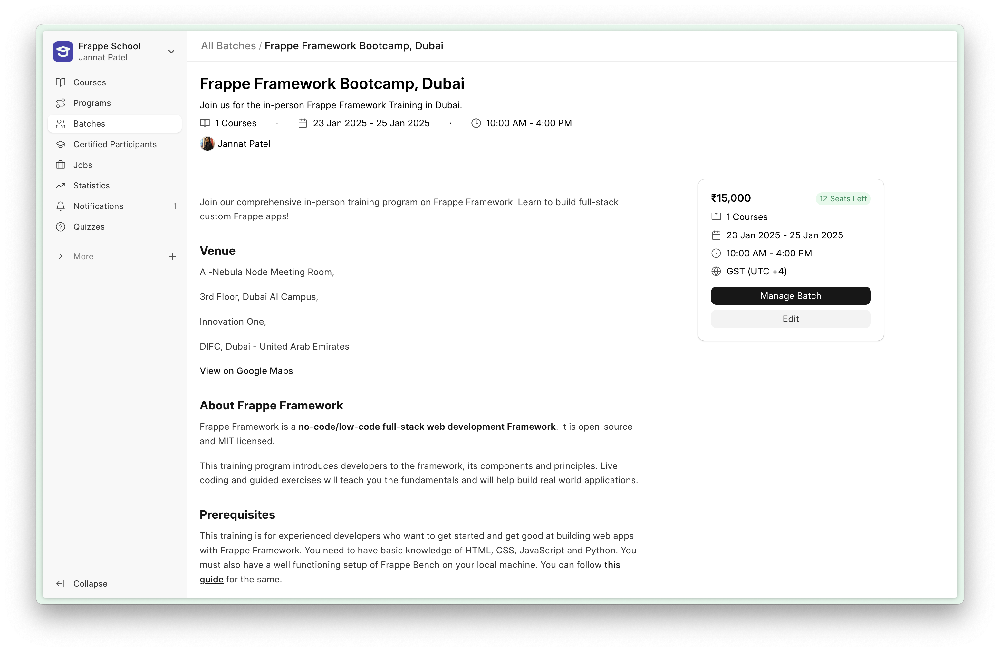

<div align="center" markdown="1">


<h1>Frappe Learning</h1>

**YUDHNA TEST Easy to use, open source, Learning Management System**


</div>


<div align="center">
	
</div>
<br />
<div align="center">
	<a href="https://frappe.io/learning">Website</a>
	-
	<a href="https://docs.frappe.io/learning">Documentation</a>
</div>

## Frappe Learning
Frappe Learning is an easy-to-use learning system that helps you bring structure to your content.

### Motivation
In 2021, we were looking for a Learning Management System to launch [Mon.School](https://mon.school) for FOSS United. We checked out Moodle, but it didn’t feel right. The forms were unnecessarily lengthy and the UI was confusing. It shouldn't be this hard to create a course right? So I started making a learning system for Mon.School which soon became a product in itself. The aim is to have a simple platform that anyone can use to launch a course of their own and make knowledge sharing easier.

### Key Features

- **Structured Learning**: Design a course with a 3-level hierarchy, where your courses have chapters and you can group your lessons within these chapters. This ensures that the context of the lesson is set by the chapter.

- **Live Classes**: Group learners into batches based on courses and duration. You can then create Zoom live class for these batches right from the app. Learners get to see the list of live classes they have to take as a part of this batch.

- **Quizzes and Assignments**: Create quizzes where questions can have single-choice, multiple-choice options, or can be open ended. Instructors can also add assignments which learners can submit as PDF's or Documents.

- **Getting Certified**: Once a learner has completed the course or batch, you can grant them a certificate. The app provides an inbuilt certificate template. You can use this or else create a template of your own and use that instead.

<details>
<summary>View Screenshots</summary>



<div align="center">
	<sub>
		Create batches to group your learners
	</sub>
</div>
<br>


<div align="center">
	<sub>
		Evaluate their knowledge by quizzes
	</sub>
</div>
<br>


<div align="center">
	<sub>
		Autenticate their work with certification
	</sub>
</div>
</details>


### Under the Hood

- [**Frappe Framework**](https://github.com/frappe/frappe): A full-stack web application framework.

- [**Frappe UI**](https://github.com/frappe/frappe-ui): A Vue-based UI library, to provide a modern user interface.

## Production Setup

### Managed Hosting

You can try [Frappe Cloud](https://frappecloud.com), a simple, user-friendly and sophisticated [open-source](https://github.com/frappe/press) platform to host Frappe applications with peace of mind.

It takes care of installation, setup, upgrades, monitoring, maintenance and support of your Frappe deployments. It is a fully featured developer platform with an ability to manage and control multiple Frappe deployments.

<div>
	<a href="https://frappecloud.com/lms/signup" target="_blank">
		<picture>
			<source media="(prefers-color-scheme: dark)" srcset="https://frappe.io/files/try-on-fc-white.png">
			
		</picture>
	</a>
</div>

### Self Hosting

Follow these steps to set up Frappe Learning in production:

**Step 1**: Download the easy install script

```bash
wget https://frappe.io/easy-install.py
```

**Step 2**: Run the deployment command

```bash
python3 ./easy-install.py deploy \
    --project=learning_prod_setup \
    --email=your_email.example.com \
    --image=ghcr.io/frappe/lms \
    --version=stable \
    --app=lms \
    --sitename subdomain.domain.tld
```

Replace the following parameters with your values:
- `your_email.example.com`: Your email address
- `subdomain.domain.tld`: Your domain name where Learning will be hosted

The script will set up a production-ready instance of Frappe Learning with all the necessary configurations in about 5 minutes.

## Development Setup

### Docker

You need Docker, docker-compose and git setup on your machine. Refer [Docker documentation](https://docs.docker.com/). After that, follow below steps:

**Step 1**: Setup folder and download the required files

    mkdir frappe-learning
    cd frappe-learning

    # Download the docker-compose file
    wget -O docker-compose.yml https://raw.githubusercontent.com/frappe/lms/develop/docker/docker-compose.yml

    # Download the setup script
    wget -O init.sh https://raw.githubusercontent.com/frappe/lms/develop/docker/init.sh

**Step 2**: Run the container and daemonize it

    docker compose up -d

**Step 3**: The site [http://lms.localhost:8000/lms](http://lms.localhost:8000/lms) should now be available. The default credentials are:
- Username: Administrator
- Password: admin

### Local

To setup the repository locally follow the steps mentioned below:

1. Install bench and setup a `frappe-bench` directory by following the [Installation Steps](https://frappeframework.com/docs/user/en/installation)
1. Start the server by running `bench start`
1. In a separate terminal window, create a new site by running `bench new-site learning.test`
1. Map your site to localhost with the command `bench --site learning.test add-to-hosts`
1. Get the Learning app. Run `bench get-app https://github.com/frappe/lms`
1. Run `bench --site learning.test install-app lms`.
1. Now open the URL `http://learning.test:8000/lms` in your browser, you should see the app running

## Learn and connect

- [Telegram Public Group](https://t.me/frappelms)
- [Discuss Forum](https://discuss.frappe.io/c/lms/70)
- [Documentation](https://docs.frappe.io/learning)
- [YouTube](https://www.youtube.com/channel/UCn3bV5kx77HsVwtnlCeEi_A)

<br>
<br>
<div align="center" style="padding-top: 0.75rem;">
	<a href="https://frappe.io" target="_blank">
		<picture>
			<source media="(prefers-color-scheme: dark)" srcset="https://frappe.io/files/Frappe-white.png">
			
		</picture>
	</a>
</div>
